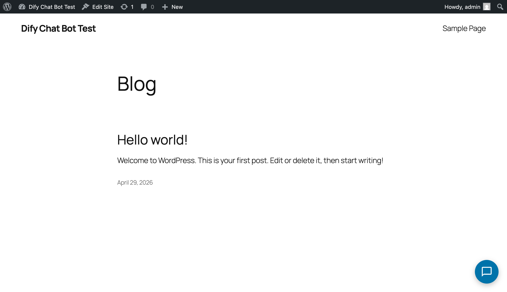
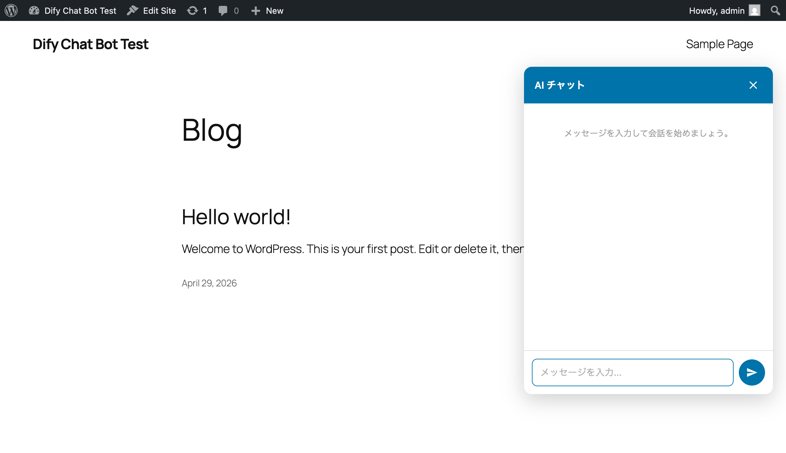
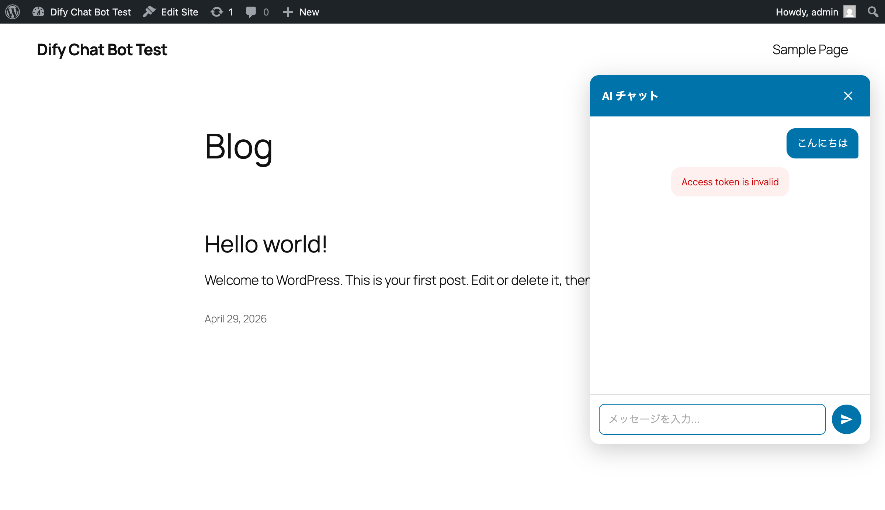
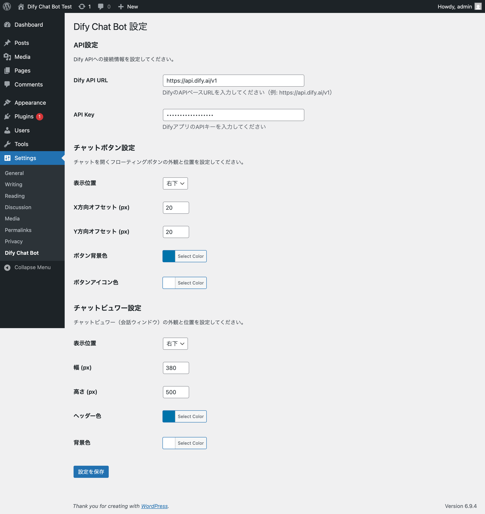
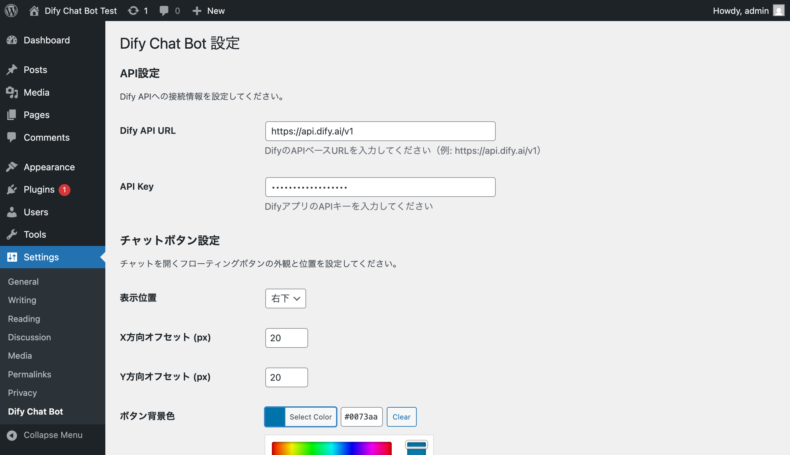
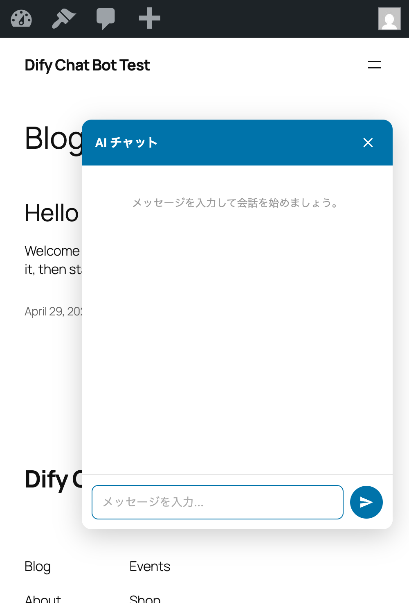
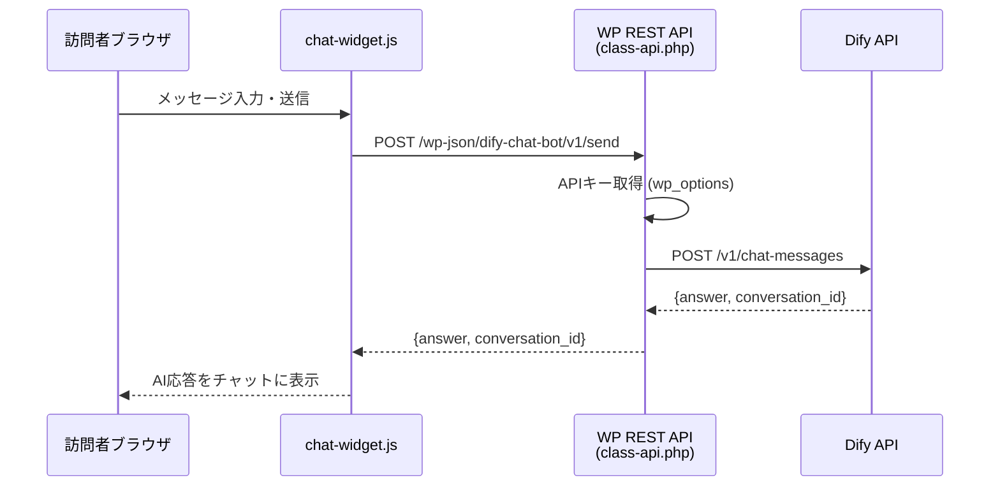

# 💬 Dify Chat Bot for WordPress

[](https://www.gnu.org/licenses/gpl-2.0)
[](https://wordpress.org/)
[](https://www.php.net/)
[](https://dify.ai/)

> **Dify AIプラットフォームと連携するWordPress用チャットボットプラグイン。管理画面からボタン・ビュワーの位置と色を自由にカスタマイズ可能。**

<p align="center">
  
</p>

## 📖 概要

Dify Chat Botは、WordPressサイトにAIチャットボットを簡単に導入できるプラグインです。DifyのChat APIと連携し、サイト訪問者がリアルタイムでAIと会話できます。APIキーはサーバー側で安全に管理され、フロントエンドに露出しません。

### なぜ作ったのか

- WordPressにAIチャットボットを導入したいが、Dify連携に対応した軽量プラグインが存在しなかった
- 既存のチャットプラグインはUIのカスタマイズ性が低く、サイトのデザインに合わせにくかった
- APIキーがフロントエンドに露出するセキュリティリスクを排除した安全な設計が必要だった

## ✨ 主な機能

- **Dify AI連携**: APIキーとURLを入力するだけでDify Chat APIと接続
- **フローティングチャットボタン**: 画面の四隅（右下/左下/右上/左上）に固定表示、オフセット調整可能
- **カスタマイズ可能なチャットビュワー**: 幅・高さ・表示位置・ヘッダー色・背景色を管理画面から設定
- **カラーピッカー付き管理画面**: WordPress標準のカラーピッカーでボタン・ビュワーの色を直感的に変更
- **セキュアなAPIプロキシ**: PHPサーバー経由でDify APIに通信し、APIキーの秘匿とCORS回避を実現
- **レスポンシブ対応**: モバイルでは全幅表示に自動切り替え
- **会話継続**: sessionStorageでconversation_idを保持し、ページ遷移後も会話を継続

## 🖼 デモ

### デスクトップ表示

| チャットボタン | チャットビュワー |
|:--:|:--:|
|  |  |

### メッセージ送受信

<p align="center">
  
</p>

### 管理画面

| 設定画面 | カラーピッカー |
|:--:|:--:|
|  |  |

### モバイル対応

<p align="center">
  
</p>

## 🛠 技術スタック

| カテゴリ | 技術 |
|:--|:--|
| バックエンド | PHP 7.4+, WordPress Plugin API, WP REST API |
| フロントエンド | Vanilla JavaScript (ES5+), CSS3 (CSS Custom Properties) |
| 管理画面 | WordPress Settings API, wp-color-picker |
| API通信 | wp_remote_post (PHPプロキシ), Fetch API (フロント) |
| AI連携 | Dify Chat API (`/v1/chat-messages`) |
| 開発環境 | Docker, docker-compose (WordPress + MySQL 8.0) |

## 🏗 アーキテクチャ



### ディレクトリ構成

```
dify-chat-bot/
├── dify-chat-bot.php          # プラグインエントリーポイント
├── includes/
│   ├── class-admin.php        # 管理画面設定 (Settings API)
│   └── class-api.php          # Dify APIプロキシ (REST endpoint)
├── assets/
│   ├── css/
│   │   ├── chat-widget.css    # チャットUIスタイル
│   │   └── admin.css          # 管理画面スタイル
│   └── js/
│       └── chat-widget.js     # チャットUIロジック
└── readme.txt                 # WordPress.org準拠readme
```

## 🚀 はじめ方

### 方法 1: ZIPファイルでインストール

1. [Releases](https://github.com/ryusei/wp-bot-plugin/releases) から `dify-chat-bot.zip` をダウンロード
2. WordPress管理画面 → **プラグイン** → **新規プラグインを追加** → **プラグインのアップロード**
3. ZIPファイルを選択して **今すぐインストール** → **有効化**

### 方法 2: 手動インストール

```bash
# プラグインディレクトリにクローン
cd /path/to/wordpress/wp-content/plugins/
git clone https://github.com/ryusei/wp-bot-plugin.git
cd wp-bot-plugin
```

WordPress管理画面 → **プラグイン** → **Dify Chat Bot** を有効化

### 設定

1. WordPress管理画面 → **設定** → **Dify Chat Bot**
2. **API設定**: DifyのAPI URLとAPIキーを入力
3. **チャットボタン設定**: 表示位置（四隅）、オフセット、背景色、アイコン色
4. **チャットビュワー設定**: 表示位置、幅、高さ、ヘッダー色、背景色
5. **設定を保存** をクリック

フロントエンドにチャットボタンが表示されます。

### 開発環境のセットアップ

```bash
# リポジトリをクローン
git clone https://github.com/ryusei/wp-bot-plugin.git
cd wp-bot-plugin

# Docker開発環境を起動
docker compose up -d

# http://localhost:8080 でWordPressにアクセス
# 管理画面: http://localhost:8080/wp-admin
```

## ⚙️ 設定項目一覧

| 設定項目 | デフォルト値 | 説明 |
|:--|:--|:--|
| Dify API URL | - | DifyのAPIベースURL (例: `https://api.dify.ai/v1`) |
| API Key | - | DifyアプリのAPIキー (例: `app-xxxx`) |
| ボタン表示位置 | 右下 | 右下 / 左下 / 右上 / 左上 |
| ボタンXオフセット | 20px | 画面端からの水平距離 |
| ボタンYオフセット | 20px | 画面端からの垂直距離 |
| ボタン背景色 | `#0073aa` | ボタンの背景色 |
| ボタンアイコン色 | `#ffffff` | ボタンのアイコン色 |
| ビュワー表示位置 | 右下 | 右下 / 左下 / 右上 / 左上 |
| ビュワー幅 | 380px | チャットウィンドウの幅 (280〜800px) |
| ビュワー高さ | 500px | チャットウィンドウの高さ (300〜800px) |
| ビュワーヘッダー色 | `#0073aa` | ヘッダーの背景色 |
| ビュワー背景色 | `#ffffff` | チャット背景色 |

## 🔒 セキュリティ

- APIキーはサーバー側（`wp_options`）にのみ保存し、フロントエンドのJavaScriptには一切露出しない
- フロントエンド → WP REST API → Dify APIのプロキシ構成でCORSの問題も回避
- 入力値はWordPressのサニタイズ関数（`sanitize_text_field`, `sanitize_hex_color`, `esc_url_raw`）で検証
- 管理画面は `manage_options` 権限を持つユーザーのみアクセス可能

## 📄 ライセンス

このプロジェクトは [GNU General Public License v2.0](https://www.gnu.org/licenses/gpl-2.0.html) の下で公開されています。
